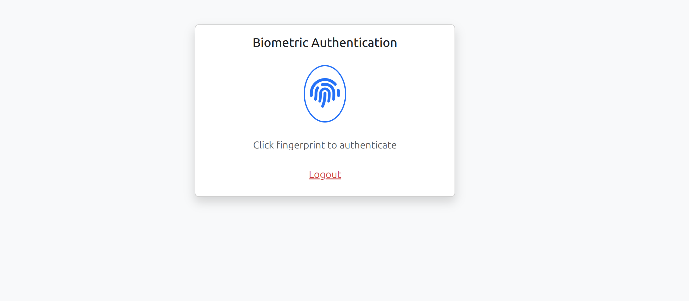
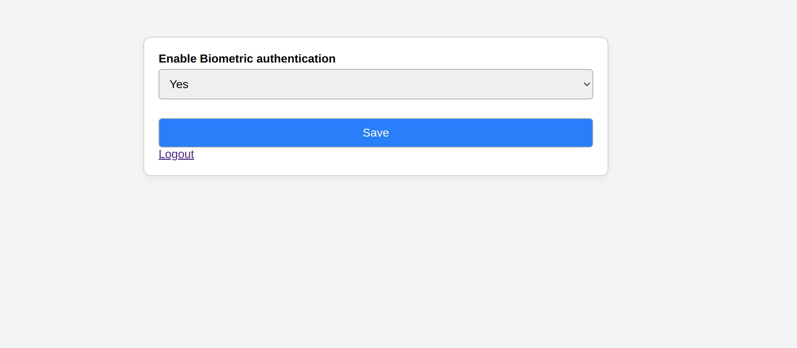

# patel/biometric-2fa-bundle

> Symfony bundle for biometric 2FA using WebAuthn

`patel/biometric-2fa-bundle` is a Symfony bundle that enables biometric two-factor authentication (2FA) using WebAuthn with support for customizable user device storage, redirect paths, and logout integration.

---

## 🚀 Installation

```bash
composer require patel/biometric-2fa-bundle
```

Then enable the bundle in `config/bundles.php` (if not auto-loaded):

```php
return [
    Biometric2FA\Biometric2FABundle\Biometric2FABundle::class => ['all' => true],
];
```

---

## ⚙️ Configuration

Create a config file:

```yaml
# config/packages/biometric_2fa.yaml
biometric_2fa:
  rp_id: "localhost"
  rp_name: "Test App"
  device_entity: 'App\Entity\UserDevice'
  redirect_path: 'app_dashboard'
  logout_path: 'app_logout'
```
add this in doctrine.yaml
```yaml
types:
    blob_string: Biometric2FA\Doctrine\DBAL\Types\BlobStringType
```

load bundle routes, (config/routes.yaml)
```yaml
biometric_2fa:
    resource: '@Biometric2FABundle/Resources/config/routes.yaml'
```
add this in service.yaml, This line tells Symfony that whenever a service (like a controller or helper) needs the UserDeviceRepositoryInterface, it should use your actual UserDeviceRepository class.

Without it, Symfony cannot auto-wire the interface because interfaces can’t be instantiated, and you haven’t told Symfony which class to use.
```yaml
Biometric2FA\Repository\UserDeviceRepositoryInterface: '@App\Repository\UserDeviceRepository'
```

## 🧩 Database Setup

Your app must implement a concrete `UserDevice` entity that extends the bundle's abstract class,
and map User entity with it, so we can store user devices.
```php
use Biometric2FA\Entity\UserDevice as BaseDevice;

class UserDevice extends BaseDevice
{
    #[ORM\ManyToOne(targetEntity: User::class)]
    #[ORM\JoinColumn(nullable: false)]
    private BiometricUserInterface $user;

    public function getUser(): BiometricUserInterface
    {
        return $this->user;
    }

    public function setUser(BiometricUserInterface $user): static
    {
        $this->user = $user;

        return $this;
    }
}
```

And a repository class that implements:

```php
use Biometric2FA\Repository\UserDeviceRepositoryInterface;

class UserDeviceRepository extends ServiceEntityRepository implements UserDeviceRepositoryInterface
{
    public function getCredentialsForUser(UserInterface $user): array
    {
        return $this->createQueryBuilder('d')
            ->select('d.credentialId')
            ->where('d.user = :user')
            ->setParameter('user', $user)
            ->getQuery()
            ->getSingleColumnResult();
    }
}
```

---

## 🧠 User Interface Requirements

Your User entity should implement:

```php
use Biometric2FA\Security\BiometricUserInterface;

class User implements BiometricUserInterface
{
    private bool $enableBioMetricsFor2fa = false;

    public function isBiometric2FAEnabled(): bool
    {
        return $this->enableBioMetricsFor2fa;
    }

    public function setBiometric2FAEnabled(bool $enabled): void
    {
        $this->enableBioMetricsFor2fa = $enabled;
    }
}
```

---

## 🛡️ Routes

The bundle exposes the following biometric routes (protected):

| Route Name                   | Path                        | Purpose                          |
|-----------------------------|-----------------------------|----------------------------------|
| `app_biometric_auth`        | `/biometric/auth`           | Biometric login UI               |
| `bio_metrics_get_args`      | `/biometric/get-args`       | Generate WebAuthn challenge args |
| `bio_metrics_create_args`   | `/biometric/create-args`    | Setup credentials challenge args |
| `bio_metrics_process_create`| `/biometric/process-create` | Save credential                  |
| `bio_metrics_verify`        | `/biometric/verify`         | Verify login assertion           |
| `bio_metrics_bio_metrics_settings`        | `/biometric/settings`       | For enable/disable biometric     |
---

## ✨ Usage in Twig

**Biometric Settings UI:**

```twig
<a href="{{ path(logout_path) }}">Logout</a>
```

---

## 📦 Features

- WebAuthn support for biometric authentication
- Device registration and secure verification
- Customizable redirect/logout path via config
- Event subscriber to enforce biometric check post-login

---

## 🧪 Testing

Ensure you call:

```bash
php bin/console doctrine:schema:update --force
```

Register your fingerprint and enable biometric login from the settings page.

---

## 📄 License

This bundle is released under the MIT License.

## 🔐 Biometric Authentication Flow


This screen prompts the user to authenticate using a biometric method such as fingerprint or Face ID.
It appears automatically when biometric 2FA is required after login.

## ⚙️ Settings Page


This page allows users to enable or disable biometric authentication for their account.
Changes are saved securely and reflected immediately in the login flow.

---

## ✨ Template Override Guide

You can fully override the default templates provided by the bundle while keeping the JavaScript functionality working.

### ✅ Required Steps

1. **Include the JS files** in your custom layout:
```twig
<script src="{{ path('common_biometrics_js') }}"></script>
<script src="{{ path('register_biometrics_js') }}"></script>
<script src="{{ path('verify_biometrics_js') }}"></script>
```

2. **Use the following `data-*` attributes** in your HTML to ensure JavaScript works correctly:

| Purpose                     | Required Attribute             |
|----------------------------|--------------------------------|
| Biometric Auth Button      | `data-biometric-auth`          |
| Settings Form              | `data-biometric-settings-form` |

### ✅ Example Override for Authentication Page

```twig



    <button data-biometric-auth class="btn">Authenticate</button>

```

### ✅ Example Override for Settings Page

```twig



    <form data-biometric-settings-form>
        ...
    </form>

```

### ✅ Flash Message Rendering (included in layout)

The layout automatically renders flash messages on page reload using Symfony's `FlashBag`.

---
